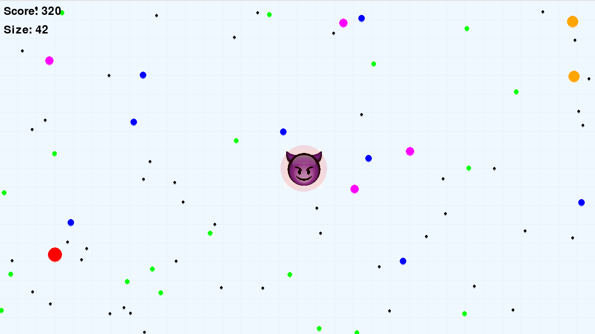

# Big Ball Swallows Small Ball 🎮

A dynamic arcade game where you control a demon ball to eat smaller dots and grow bigger. Features both manual play and AI learning modes.

## ✨ Features

- Demon-themed player ball with rainbow glow effects
- 6 types of food dots with unique behaviors
- Dynamic dot movements with bounce physics
- High score system
- Two play modes: Manual and AI
- Real-time visual effects and particle systems

## 🎯 Game Modes

### Manual Play
Control your demon ball directly:
- ↑ Move up
- ↓ Move down
- ← Move left
- → Move right
- SPACE Restart after game over

### AI Training Mode
Watch and train an AI agent to play:

## 🎲 Game Elements

### Food Types
- 🔵 Black dot (3px) - 10 points
- 🟢 Green dot (5px) - 20 points
- 🔷 Blue dot (7px) - 30 points
- 🟣 Purple dot (9px) - 40 points
- 🟡 Orange dot (12px) - 80 points
- 🔴 Red dot (15px) - 160 points

### Victory & Defeat
- Win: Reach 5000 points
- Lose: Touch any dot larger than yourself

## 🎮 How to Play

### Installation
```bash
# Install game dependencies
pip install -r requirements.txt
```

### Running the Game
```bash
# Manual play mode
python manual_play.py
```

```bash
# AI training mode with game rendering.
python train.py --render

# AI training mode, text only

python train.py
```

```bash
# Test trained AI
python test.py --model models/model_1000.pth --render
```

## 🤖 AI Training Features

- Deep Q-Network (DQN) implementation
- Prioritized Experience Replay
- Dynamic reward system
- Real-time training visualization
- WandB integration for metrics tracking

## 🛠️ Development

- Python 3.10+
- Pygame 2.6.1
- PyTorch for AI training
- WandB for experiment tracking

## 📊 High Scores
Scores are automatically saved in `highscores.json`. Only top 10 scores are kept.

## 🎵 Sound Effects
Coming soon!

---

Have fun!